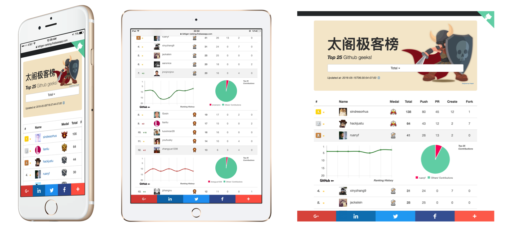
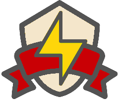

# 太阁极客榜 (BitTiger Geeks Ranking)
[](http://gruntjs.com/)

**太阁极客榜**（or **BitTiger Geeks Ranking**）is a real-time ranking board for BitTiger's Github members. Its results are based on members' Github activities in the past seven days with daily updates at **06:30 PDT**.

**Demo**: https://bittiger-ranking.firebaseapp.com



## Motivation
By showing the Github members' activities in a game-style ranking board,  we can finally help the github members grow their interests and get more engaged in coding.

> We intentionally introduce some [top coders](https://github.com/hackjustu/Github-Project-Dashboard/blob/dev/helpers/top_coders.js) in our ranking board just to have more fun;)

## Components
This project consists of three components: 

1.  A crawler to dig the members' public data and calculate their rankings.
2.  A Firebase-powered persistence layer for the crawled data.
3.  A front-end single-page app to show the members' rankings from the persistence layer.

> **This repository is for the front-end app.** Click [here](https://github.com/hackjustu/Github-Project-Dashboard) to see the crawler app.

## Usage
```
npm install
bower install
grunt build
```
The output is inside the build folder.

## Firebase Date Structure
**Firebase URL**: [https://bittiger-ranking.firebaseio.com](https://bittiger-ranking.firebaseio.com)

```
bittiger-ranking
 |__ + user_events
 |__ + user_ranking_info
```

`user_events` is the data displayed on the ranking board. The data is set by the crawler app and retrieved by the front-end web app.

- `created_time`: the most recent update time
- `events`: a sorted array of the latest user data
- `event - <number> - ranking_history`: the user's most recent 10 rankings
 
```
user_events
 |__ created_time: "2016-05-09T18:37:44-07:00"
 |__ + events
       |__ + 0
       |__ + 1
       		 |__ CreateEvent: 11
       		 |__ ForkEvent: 4
       		 |__ PullRequestEvent: 6
       		 |__ PushEvent: 23
       		 |__ Total: 44
       		 |__ avatar_url: "https://avatars.githubusercontent.com/u/7756581?v=3"
       		 |__ html_url: "https://github.com/hackjustu"
       		 |__ login: "hackjustu"
       		 |__ organization: "bittiger"
       		 |__ ranking_change: 0
       		 |__ + ranking_history
       		 		    |__ + 0	  
       		 		    |__ + 1
       		 		          |__ ranking: 3
       		 		          |__ timestamp: "2016-05-09T06:30:03-07:00"
       		 			    
```

`user_ranking_info` helps store users' most recent 100 ranking history. As now, this data is only used by the crawler app.

- `<user1's login>`: Usually we call it the username for the Github member. It is the same value as shown in the previous `user-events - events - <number> - login`

```
user_ranking_info
     |__ + <user1's login>
     |__ + <user2's login> 
     |__ + hackjustu
     			|__ + 0
     			|__ + 1
       		 		  |__ ranking: 3
       		 		  |__ timestamp: "2016-05-08T06:30:03-07:00"
```

## Ranking Algorithm
We compare `Total`, `PushEvent`, `PullRequestEvent`, `CreateEvent` and `ForkEvent` in sequence and stop at the first available result. 

**Total = PushEvent + PullRequestEvent + CreateEvent + ForkEvent**

> **Note:** If you have multiple commits in one push event, we still count it one score. People have suggested using the number of `commit` instead of `push`. We could probably adopt this some time, but at this moment, we still count `push`.

Users can sort the members by other order such as just `PushEvent` or `ForkEvent`, but we use the ranking of `Total` for our medal system in the next section.

## Medal System
We adopt a medal system for fun, beacasue we love gaming~~

| Medal     | Icon |   Scores (Total) |
| :--------:| :--: | :--------:| 
| Gold      | | > 49  |
| Silver    | | 20 - 49   |
| Bronze    | | < 20      |

## To Do List
- [ ] More stylish medal icons (We need a designer...)
- [ ] Integration into BitTiger/Wukong system
- [ ] Achievement system
- [ ] Better crawler for more user/repository information

## Team Members
||
|:--:|
||
|[Cosmo](https://github.com/hackjustu)|

## Acknowledgment
- Project [Wukong](https://github.com/BitTigerInst/Gear) contributes the prototype for the backend github crawler.
- [Freepik](http://www.freepik.com/) contributes several cool free images.

## License
MIT © [Cosmo](https://github.com/hackjustu)

## Repository information
- category: full stack
- team: Fighting Falcon
- description: A real-time ranking board for BitTiger's Github members.
- stack: angular, firebase


